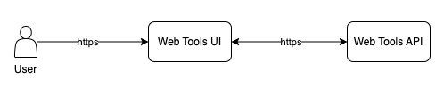
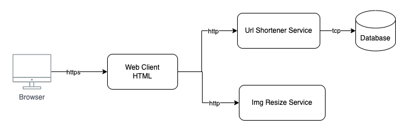
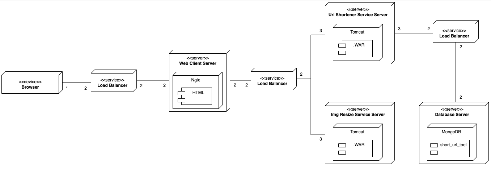
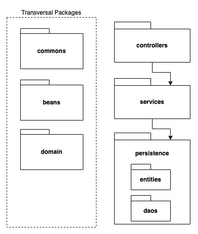

# Farmu-challenge

## Prerequisitos

Con el fin de ejecutar la aplicación de forma local se requiere que tengas instalado en tu máquina el siguiente software:

* **Maven**, asegurate de tener configuradas las variables de entorno para ejecutarlo desde consola. [Instrucciones de instalación](https://maven.apache.org/download.cgi)
* **Docker Desktop**, puedes encontrar las instrucciones de instalación en el [Docker website](https://www.docker.com/products/docker-desktop/).

## Instalación

La aplicación requiere que los siguientes puertos en tu máquina esten disponibles: **4080, 5080, 6080 y 7080**. Si alguno de estos puertos está ocupado puedes cambiarlo desde el archivo **docker-compose.yml**.

Para ejecutar la aplicación sigue los siguientes pasos:
1. Descarga o clona el repositorio de github desde [https://github.com/akane34/farmu-challenge.git](https://github.com/akane34/farmu-challenge.git)
2. Abre una terminal y ve a la raiz del repositorio descargado: /farmu-challenge
3. Ejecuta los siguientes comandos en orden:
	* >mvn clean install -f backend/web-tools-img-resize-api/pom.xml
	* >mvn clean install -f backend/web-tools-short-url-api/pom.xml
	* >docker-compose up --build

Al terminar de ejecutarse los comandos se puede acceder a la aplicación desde la URL: [http://localhost:7080](http://localhost:7080)

Cunado quieras bajar la aplicación ejecuta el comando: **>docker-compose down**

Los comandos anteriores despliegan la apliación en 4 contenedores de docker, los cuales colaboran entre si para dar solución al requerimiento planteado, los contenedores son:
* **ttf-mongodb**: Base de datos MongoDB que persiste información del servicio de Acortador de URLs.
* **ttf-tools-short-url-api**: Servicio de Acortador de URLs.
* **ttf-tools-img-resize-api**: Servicio de Redimencionador de Imagenes.
* **ttf-web-tools-ui**: Pagina HTML que permite acceder a los servicios.

## Arquitectura

A continuación se muestra la definición de arquitectura del sistema Web Tools, la arquitectura se realizó usando el Modelo C4 y se centró pincipalmente en el modelo de despliegue.

El diseño se basó en los siguientes supuestos:
* Se dispone de balanceadores de carga y éstos no entran dentro de las 10 máquinas disponibles para el despliegue.
* Los nodos desarrollados pueden ser desplegados en máquinas virtuales, físicas o contenedores Docker.
* No se conoce los niveles de carga esperados, ni los niveles de performance aceptables.
* No se detalló en componenstes de red, como por ejemplo, VPNs, DMZ, NATs, etc.

### Solución con Modelo C4

Para la documentación de los diagramas se usó el Modelo C4 que permite de una forma sencilla y ágil
describir una arquitectura. Se basa en 4 vistas: Contexto, Contenedores, Componentes y Código.

Los diagramas se realizaron en Drawio el cual puede ser abierto en linea desde (https://app.diagrams.net/)
y el archivo original que permite una mejor visualización se encuentra en el siguiente enlace:
https://drive.google.com/drive/folders/1rj2nOc3c3ahSWb4TwchtymzRo5J_p2wp?usp=share_link

A continuación, se presenta cada una de sus vistas.

#### 1. Contexto

#### 2. Contenedor

Se empleó una arquitectura Cliente-Servidor, donde se usó un Cliente liviando HTML que se comunica con 2 Servicios: UrlShortenerService y ImgResizeService, cada uno de estos servicios son independientes entre si y pueden ser desplegados independientemente. Por último tenemos una base de datos NoSql que persiste la información del servicio UrlShortenerService.

#### 3. Componente

En esta vista se centró la atención en el modelo de despliegue de la aplicación y no se incluyó información de otros diagramas.

En total se emplean 10 Maquinas, las cuales están distribuidas de la siguiente forma:
* **Cliente Web:** 2 máquinas.
* **UrlShortenerService:** 3 máquinas.
* **ImgResizeService:** 3 máquinas.
* **MongoDb:** 2 máquinas.

La distribución se basó en tener mínimo 2 máquinas por servicio por cuestiones de disponibilidad (redundancia Activa), las 2 máquinas restantes se asignaron a los Servicios de Backend, ya que éstos son los que más carga tendrán, teniendo en cuenta que el Frontend prácticamente son documentos estáticos que realizan poco procesamiento.

#### 4. Código

Los Servicios se desarrollaron usando una Arquitectura por capas simple, las cuales son accedidas a través de un controlador REST.

